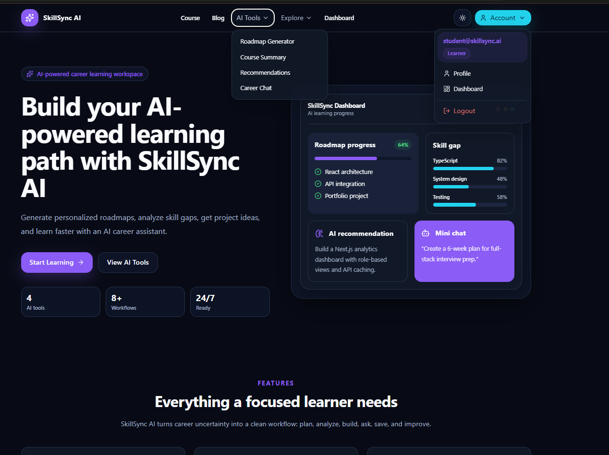
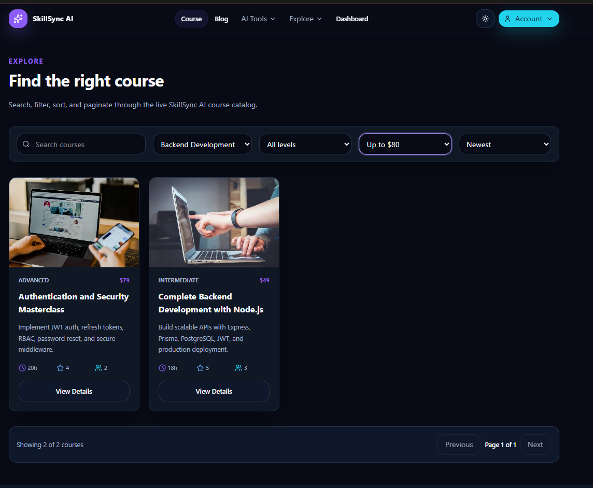
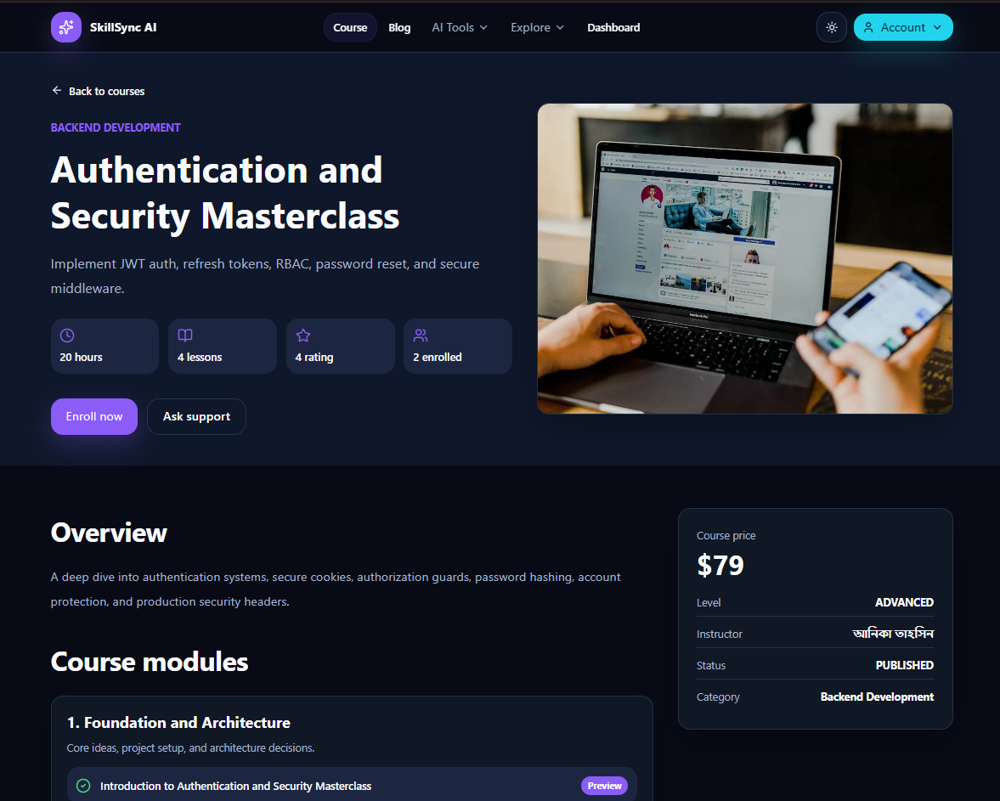
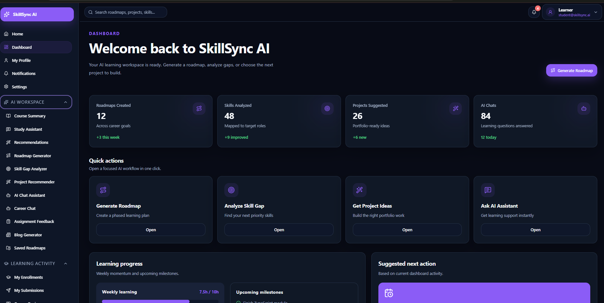
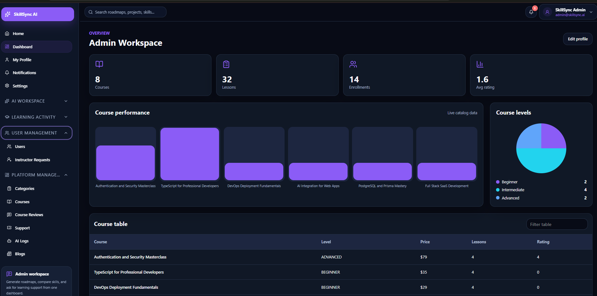
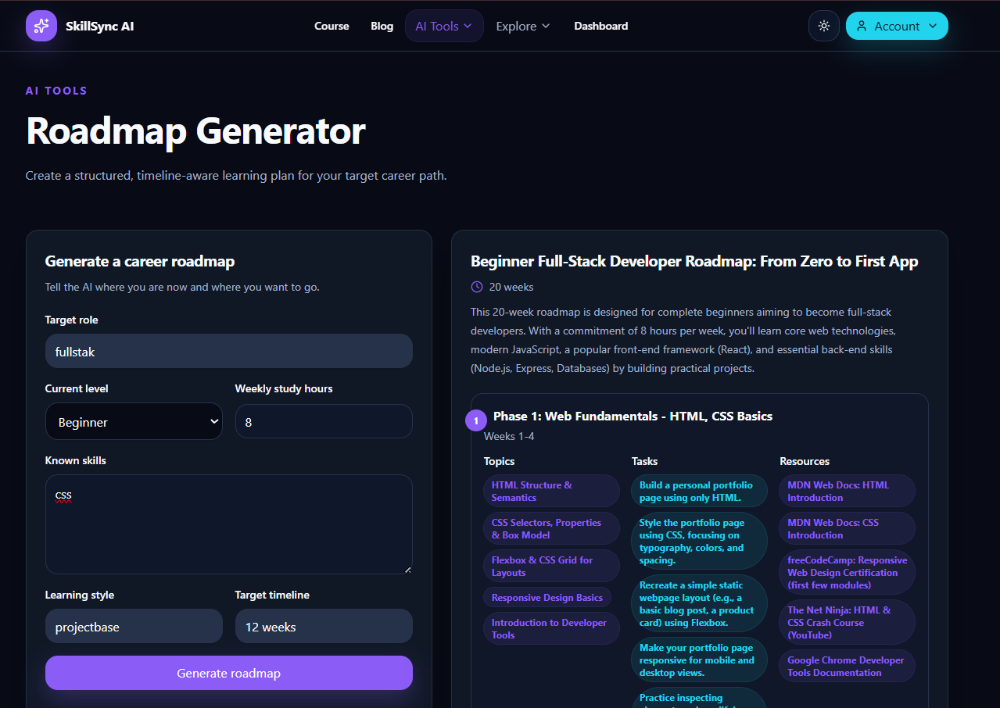

# SkillSync AI

The polished web experience for **SkillSync AI**, an AI-powered learning management platform that connects course discovery, learning progress, role-based dashboards, support, notifications, instructor promotion requests, and real AI learning workflows.

Built with Next.js App Router, TypeScript, Tailwind CSS, TanStack Query, Zustand, React Hook Form, and Zod, this frontend is designed to feel like a real SaaS product: responsive, role-aware, data-driven, validated, and presentation-ready.

## AI Feature Spotlight

SkillSync AI is built around practical AI learning workflows, not decorative AI buttons. The frontend gives users polished, validated interfaces for real backend AI endpoints and presents outputs in a way learners can act on immediately:

- **Roadmap Generator:** learners enter a goal, level, and weekly hours, then receive a structured learning plan.
- **Skill Gap Analyzer:** learners compare current skills against a target role and see prioritized gaps.
- **Project Recommender:** learners get project ideas based on role, level, and skills.
- **AI Chat Assistant:** users ask learning, project, roadmap, or career questions in a dashboard chat interface.
- **Course Summary:** users can generate summaries for courses before choosing what to study.
- **Smart Recommendations:** users can request course suggestions based on interests and learning history.
- **Assignment Feedback:** users can submit links or notes and receive improvement-focused feedback.
- **Blog Generator:** admins/instructors can generate education-focused blog drafts.

Every AI screen includes typed payloads, form validation, loading states, error handling, and structured result rendering. The frontend never fakes AI results; it depends on the backend AI API and shows clear errors when the provider is unavailable.

## Table of Contents

- [Project Overview](#project-overview)
- [Problem Statement](#problem-statement)
- [Solution Overview](#solution-overview)
- [Tech Stack](#tech-stack)
- [Key Features](#key-features)
- [Screenshots / GIFs](#screenshots--gifs)
- [Setup Instructions](#setup-instructions)
- [Environment Variables](#environment-variables)
- [API / Architecture](#api--architecture)
- [Live Demo and Credentials](#live-demo-and-credentials)
- [Quality Signals](#quality-signals)
- [Folder Structure](#folder-structure)
- [Available Scripts](#available-scripts)
- [Contact](#contact)

## Project Overview

SkillSync AI Frontend is the user-facing application for an AI-powered learning management system. It supports public visitors, students, instructors, and admins through a responsive, role-aware App Router interface that feels cohesive across marketing pages, course discovery, AI tools, and dashboards.

The frontend includes:

- Public landing page with meaningful sections, category carousel, featured courses, FAQ, newsletter, support preview, and interactive image sections
- Course listing with debounced search, filters, sorting, pagination, category deep links, and skeleton states
- Course details page with overview, instructor, lessons, reviews, related data, and enrollment action
- Authentication pages with login, registration, Google login, email verification, forgot password, and reset password
- Role-based dashboards for students, instructors, and admins
- Notification center with unread count and mark-read actions
- Instructor promotion request UI for students and admin approval UI
- AI workspaces for roadmap, skill-gap analysis, project recommendations, chat, summaries, recommendations, feedback, and blog generation

## Problem Statement

Learners often use separate tools for courses, progress tracking, assignments, feedback, support, and AI planning. This creates friction: the roadmap is in one place, coursework is elsewhere, and feedback is disconnected from goals. A serious learning product needs one coherent interface that connects discovery, learning, review, support, and AI guidance.

## Solution Overview

SkillSync AI Frontend solves this with a modular Next.js application. Public pages help users explore the platform, while protected dashboards expose role-specific workflows. TanStack Query handles server data, Zustand stores auth state, React Hook Form and Zod validate forms, and reusable UI components keep the experience consistent. The app communicates with the SkillSync AI backend through typed API helpers and displays loading, error, empty, and success states across key workflows.

## Why This Project Stands Out

- **Presentation-ready landing page:** meaningful sections, interactive images, category carousel, featured courses, testimonials, FAQ, newsletter, and support preview.
- **Real product navigation:** active public nav, responsive dashboard sidebar, profile menus, notification badge, and role-aware route groups.
- **Practical AI workflows:** AI pages are tied to learning decisions such as roadmaps, skill gaps, projects, summaries, feedback, and career chat.
- **Typed frontend architecture:** API helpers, TypeScript types, form schemas, query hooks, and reusable components reduce accidental complexity.
- **Dashboard depth:** student, instructor, and admin pages expose tables, actions, charts, notifications, support, promotion requests, and AI logs.

## Tech Stack

- Framework: Next.js App Router
- Language: TypeScript
- UI: Tailwind CSS, custom reusable components, Lucide icons
- State: Zustand
- Data fetching: TanStack Query
- Forms: React Hook Form
- Validation: Zod
- HTTP: Fetch API and Axios helpers
- Notifications: Sonner
- Runtime/tooling: Bun, ESLint, TypeScript, Vercel-ready Next build

## Key Features

- Responsive public landing page with active navbar, advanced menus, dark/light mode, and project-specific content
- Course listing with debounced search, category filter, level filter, price filter, sorting, and pagination
- Category carousel on home page with image cards and links to filtered course results
- Public course details page with enrollment CTA
- Login and registration flows with form validation and API error handling
- Google OAuth entry point connected to backend auth helpers
- Role-based routing and dashboard navigation for student, instructor, and admin users
- Dashboard overview cards and chart-style visualizations
- Data tables for users, courses, categories, assignments, submissions, reviews, support, AI logs, notifications, and promotion requests
- Paginated dashboard tables with search, actions, loading states, empty states, and API error display
- Profile editing with validated form input
- Support ticket management and reply workflows
- Notification bell, unread count, notification center, mark-read actions, and backend notification route integration
- Instructor promotion request form for students and admin approval/rejection screens backed by promotion request routes
- AI feature pages with real API integration, loading states, errors, and structured outputs

## Screenshots / GIFs

### Landing page



### Course discovery



### Course details



### Student dashboard



### Admin dashboard



### AI roadmap generator



## Setup Instructions

### Prerequisites

Before running the project, make sure you have:

- Bun installed
- Node.js 20.x available
- SkillSync AI backend running locally or deployed

### Local Setup

Clone the repository:

```bash
git clone https://github.com/FahimMuntasir0417/SkillSync-AI-Frontend
cd SkillSync-AI-Frontend
```

Install dependencies:

```bash
bun install
```

Create a `.env` file in the root directory.

Run the development server:

```bash
bun run dev
```

Open:

```text
http://localhost:3000
```

### Production Build

```bash
bun run build
bun run start
```

## Environment Variables

Create a `.env` file in the project root. Do not commit real secrets.

```env
NEXT_PUBLIC_API_BASE_URL=your_backend_base_url
NEXT_PUBLIC_APP_URL=your_clint_ url
```

`NEXT_PUBLIC_API_BASE_URL` should point to the SkillSync AI backend API base URL.

## API / Architecture

### Backend Dependency

The frontend expects the SkillSync AI backend API to run at:

```text
NEXT_PUBLIC_API_BASE_URL
```

Important backend route groups:

| Feature            | Routes                                                                                              |
| ------------------ | --------------------------------------------------------------------------------------------------- |
| Auth               | `/auth/login`, `/auth/register`, `/auth/me`, `/auth/logout`, `/auth/refresh-token`                  |
| Courses            | `/courses`, `/courses/:slug`, `/courses/featured`, `/courses/related/:courseId`                     |
| Enrollments        | `/enrollments/:courseId`, `/enrollments/my-classes`                                                 |
| Dashboard          | `/dashboard/student`, `/dashboard/instructor`, `/dashboard/admin`                                   |
| Support            | `/support/tickets`                                                                                  |
| Notifications      | `/notifications`, `/notifications/unread-count`                                                     |
| Promotion Requests | `/promotion-requests`                                                                               |
| AI                 | `/ai/roadmap`, `/ai/skill-gap`, `/ai/project-recommendations`, `/ai/chat`, and related AI endpoints |

### Frontend Architecture Highlights

- App Router route groups separate public, auth, dashboard, and protected pages
- `src/lib/api/skillsync.ts` centralizes typed backend API calls
- `src/features` contains domain-focused hooks, services, schemas, and components
- `src/components/ui` provides reusable design primitives
- `src/components/layout` contains public and dashboard navigation shells
- `src/providers/query-provider.tsx` configures TanStack Query globally
- `src/features/auth/store/auth-store.ts` stores auth state with Zustand
- Zod schemas define form and response contracts where needed
- Protected routes are guarded through `src/proxy.ts` and client-side dashboard checks

### Request Flow

```text
User action
  -> Component / Form
  -> Zod validation
  -> TanStack Query mutation/query
  -> API helper
  -> Backend API
  -> Loading / error / success UI
```

## Live Demo and Credentials

### Project Links

- Frontend Repo: https://github.com/FahimMuntasir0417/SkillSync-AI-Frontend
- Backend Repo: https://github.com/FahimMuntasir0417/SkillSync-AI-Backend
- Frontend Live: https://skill-sync-ai-frontend.vercel.app/
- Backend Live: https://skill-sync-ai-backend.vercel.app/
- Demo Video: https://drive.google.com/file/d/1emZQGxEL78LvL4-J-XpppBt8SJ6slVTa/view?usp=sharing

### Demo Credentials

Use demo credentials only for non-production demonstrations.

| Role       | Email                     | Password         |
| ---------- | ------------------------- | ---------------- |
| Student    | `student@skillsync.ai`    | `Student@123`    |
| Instructor | `instructor@skillsync.ai` | `Instructor@123` |
| Admin      | `admin@skillsync.ai`      | `Admin@123`      |

## Quality Signals

This frontend is structured to show the signals recruiters and reviewers look for in a strong full-stack submission:

- **Clear problem understanding:** the UI connects AI planning with real LMS workflows instead of showing isolated AI demos.
- **Clean installation steps:** Bun setup, environment config, development server, and production build are documented.
- **System design thinking:** route groups, feature modules, API boundaries, form schemas, and query state are separated.
- **Security awareness:** API URLs are environment-driven, auth tokens are isolated, protected pages are guarded, and role-based routes are enforced.
- **Scalability considerations:** reusable layouts, shared API clients, dashboard resource views, typed contracts, and role-aware navigation reduce duplication.
- **UX maturity:** loading, error, empty, success, responsive, dark mode, active navigation, and dashboard states are treated as first-class UI concerns.

## Folder Structure

```text
SkillSync AI Frontend/
|
+-- public/
+-- src/
|   +-- app/
|   |   +-- (auth)/
|   |   +-- (dashboardLayout)/
|   |   +-- (publicLayout)/
|   +-- components/
|   |   +-- courses/
|   |   +-- home/
|   |   +-- layout/
|   |   +-- ui/
|   +-- config/
|   +-- contracts/
|   +-- features/
|   |   +-- ai-chat/
|   |   +-- ai-tools/
|   |   +-- auth/
|   |   +-- project-recommender/
|   |   +-- roadmap/
|   |   +-- skill-gap/
|   +-- lib/
|   |   +-- api/
|   |   +-- auth/
|   |   +-- axios/
|   +-- providers/
|   +-- services/
|   +-- types/
+-- package.json
+-- next.config.ts
+-- tsconfig.json
```

## Available Scripts

| Command             | Description                        |
| ------------------- | ---------------------------------- |
| `bun run dev`       | Run the Next.js development server |
| `bun run build`     | Build the production app           |
| `bun run start`     | Start the production server        |
| `bun run lint`      | Run ESLint                         |
| `bun run typecheck` | Run TypeScript compile check       |
| `bun run check`     | Run typecheck, lint, and build     |

## Contact

- Live URL: https://skill-sync-ai-frontend.vercel.app/
- Backend API: https://skill-sync-ai-backend.vercel.app/
- Frontend Repo: https://github.com/FahimMuntasir0417/SkillSync-AI-Frontend
- Backend Repo: https://github.com/FahimMuntasir0417/SkillSync-AI-Backend
- Email: fahimmuntasirbejoy@gmail.com
- WhatsApp: 01571042536
- Facebook: https://www.facebook.com/mohammad.fahim.muntasir
- LinkedIn: https://www.linkedin.com/in/md-fahim-muntasir-aa536b366/

Live Frontend URL:https://skill-sync-ai-frontend.vercel.app/
Live Backend URL:https://skill-sync-ai-backend.vercel.app/

Frontend GitHub Repository:https://github.com/FahimMuntasir0417/SkillSync-AI-Frontend
Backend GitHub Repository:https://github.com/FahimMuntasir0417/SkillSync-AI-Backend

Demo Video: https://drive.google.com/file/d/1emZQGxEL78LvL4-J-XpppBt8SJ6slVTa/view?usp=sharing

Student Email: student@skillsync.ai
Student Password: Student@123

Admin Email: admin@skillsync.ai
Admin Password: Admin@123

Instructor Email: instructor@skillsync.ai
Instructor Password: Instructor@123

AI Features Explanation::
Roadmap Generator: Creates a personalized step-by-step learning roadmap based on the user’s goal, level, skills, and timeline.
Course Summary: Generates a short AI summary so users can quickly understand a course before studying.
Smart Recommendations: Suggests relevant learning paths, courses, or skills based on the user’s interest.
Career Chat Assistant: Acts like an AI mentor for career guidance, learning advice, and next-step planning.
Skill Gap Analyzer: Compares current skills with a target role and identifies missing skills.
Project Recommender: Suggests portfolio project ideas based on the user’s role, level, and technologies.
Assignment Feedback: Provides AI-generated feedback to help students improve submitted work.
Blog Generator: Creates educational blog drafts for instructors or admins.
